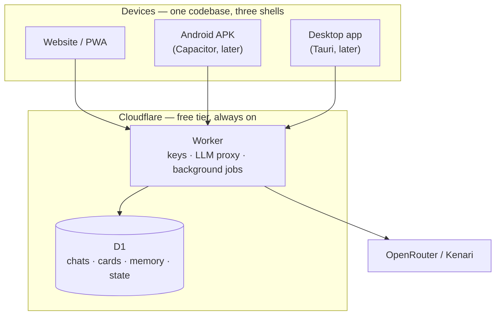

# Personal AI Roleplay Client — Build Plan

**Date:** 2026-09-29
**Status:** Design complete, ready to build
**Target:** A personal, BYOK, cache-optimized roleplay client that runs on phone and desktop with no self-hosted server.

---

## 0. The one-paragraph version

A single TypeScript web app, deployed as a website and later wrapped as an Android APK and a desktop binary. It talks to OpenRouter and Kenari (both verified browser-callable) through a small Cloudflare Worker that holds the API keys and runs background jobs. Chats, characters, memory, and world state live in Cloudflare D1, so phone and laptop always agree and nothing depends on the laptop being awake. The reason to build it instead of using SillyTavern or Kelivo is a **prefix-stable prompt assembler** — every provider caches only the exact token prefix from position 0, and every existing roleplay frontend mutates that prefix every turn. The measured cost of that mistake in a real roleplay app is a 46.5% cache hit rate where 91.5% was achievable.

---

## 1. Hard constraints

These were established during the interview and are not negotiable:

| # | Constraint | Consequence |
|---|---|---|
| C1 | **Mobile must work with the laptop off.** | No self-hosted server. SillyTavern's architecture is disqualified. |
| C2 | Personal use, solo dev, free tiers acceptable. | Cloudflare free tier only. No paid infra. |
| C3 | **The AI writes the code; the user reviews and directs.** | Boring, well-known stack. No exotic patterns. Small, independently verifiable steps. |
| C4 | Android is the phone. | Sideloaded APK is viable; no store policy fight. |
| C5 | Steady pace, a few months. | Correctness over speed, but every milestone independently useful. |
| C6 | Providers: **OpenRouter + Kenari**. | Both verified CORS-permissive. OpenAI unreachable directly. |

---

## 2. Architecture



**Why the Worker exists** (it is not a website host — the website is static files on Cloudflare Pages):

1. Holds API keys so they never sit in device storage and survive a lost phone.
2. One place to implement provider quirks (Anthropic's browser header, OpenRouter's `session_id` stickiness).
3. **Runs summarization and state extraction after a turn, even when the app is closed.** This is impossible client-only.
4. Server-side `cached_tokens` logging — the only way a cross-device cache dashboard can exist.
5. Makes OpenAI reachable, since its completions endpoint returns no `Access-Control-Allow-Origin` at all.

**Build order:** website first. Capacitor APK and Tauri desktop are wrappers around the same `dist/` and get added when specifically missed.

---

## 3. The core differentiator: cache-safe context assembly

### 3.1 The rule

> Every provider caches only the **exact token prefix, from token 0**. A cache breakpoint marks the *end* of a cacheable prefix, not an isolated region. Therefore: **keep the first N tokens byte-identical across turns, and append everything else.**

### 3.2 Provider cache mechanics (verified 2026-09)

| Provider | Activation | Min cacheable | TTL | Write | Read |
|---|---|---|---|---|---|
| Anthropic | explicit `cache_control` (≤4 breakpoints) | 512–4096 by model | 5 min (free refresh on hit); 1 h option | 1.25× / 2× | **0.1×** |
| OpenAI | automatic; explicit breakpoints on GPT-5.6+ | 1024 | 5–10 min; 30 min on 5.6+ | 0 (pre-5.6) / 1.25× | 0.1× |
| Gemini | implicit (auto) or explicit `cachedContents` | **4096** (3.x) | 3–5 min implicit; 1 h explicit | 0 / +storage | 0.25× |
| DeepSeek | automatic, no code change | 64 | hours–days | 0 | **0.1×** |
| xAI Grok | automatic + `x-grok-conv-id` | unpublished | unpublished | 0 | 0.25× |
| Mistral | automatic + `prompt_cache_key` | 64 | unpublished | 0 | 0.1× |
| Qwen | explicit or implicit (mutually exclusive) | 1024 | 5 min explicit | 1.25× / 1.0× | 0.1× / 0.2× |
| Groq | automatic | unpublished | 2 h idle | 0 | 0.5× |

**DeepSeek is the best fit for roleplay**: 0.1× reads, no write premium, its own docs name roleplay as a headline scenario, and it was the only provider still warm after 45 minutes in independent testing (most evict in 1–15 min).

### 3.3 Anti-patterns — every one of these is live in SillyTavern

| # | Anti-pattern | Damage |
|---|---|---|
| A | **Dynamic content in the system prompt** (`{{time}}`, `{{date}}`, session IDs) | A timestamp line took a measured hit rate from **91% → 0%** |
| B | **Reordering anything in the prefix** (lorebook sorted by relevance) | Prefix hash changes → write every turn, zero reads |
| C | **Injecting memory/lorebook into the middle of history** | Mutates the prefix from the injection point onward |
| D | **Sliding-window truncation dropping the oldest message** | Prefix now starts at a different token — nothing matches |
| E | **Re-summarizing on a schedule** | Full cache rebuild; naive compaction diverges at token 0 and costs full price |
| F | **Vector retrieval that splices messages out of history** | ST's own docs: *"You have to choose [caching or vectorization], but not both"* |
| G | **Being under the minimum cacheable length** | Silently never caches, no error returned |

**Measured impact in a real roleplay app** (Foreverse/SillyTavern benchmark, 2026-07-24):
- Lorebook-heavy card: **22.6%** hit rate
- Constant-entry card: **74.3%**
- Fixed via *entry residency*: **89.9%**

> **The lorebook, not the engine, is the dominant cache variable in roleplay apps.**

### 3.4 The layout

Strictly ordered, stable-at-the-head, append-only:

```
[ IMMUTABLE HEAD ]  ← cached; never changes for the life of the chat
  1. System prompt           (static text; NO time, NO date, NO IDs)
  2. Character card          (description, personality, scenario)
  3. Example dialogue        (mes_example)
  4. Persona / user card
  5. World book — ALWAYS-ON entries, in a fixed order
  6. Preset rules            (FF5-style modules if imported)

[ GROWING BODY ]  ← cached; append-only
  7. Chat history            (oldest → newest, never reordered, never spliced)

[ VOLATILE TAIL ]  ← uncached; the only part that changes per turn
  8. Retrieved memory        (recall results, formatted as an appended block)
  9. Scene state             (time · place · present · mood · relationships)
 10. Author's note / steering
 11. Current user message
```

**Key rules:**
- Dynamic blocks go **at the tail**, not the head. This resolves the apparent conflict between "important info last" and "stable prefix" — the Lost-in-the-Middle and context-rot research says top *and* bottom beat the middle, and caching says the head must be stable. Both are satisfied.
- **Lorebook entries are resident, not triggered.** Keyword-triggered entries walking in and out of the prompt head is the single biggest cache-killer. Entries enter the always-on block and stay.
- **Recall appends; it never splices.** Retrieved messages are *copied* to the tail as a reference block. The originals stay in the history array untouched.
- **Truncation is sawtooth, not sliding.** Hold the oldest included message fixed; grow by appending; truncate in one shot at the cap and re-anchor. Never drop the oldest message every turn.
- **`session_id` is always sent** to OpenRouter. Without it, sticky routing only activates *after* a hit is observed.
- **Never let a UI control pin a provider order** — that silently disables OpenRouter's sticky routing, which is what makes its caching work at all.

### 3.5 Cache observability (nobody ships this)

Per-response, read and store: `usage.prompt_tokens_details.cached_tokens`, `.cache_write_tokens`, `usage.cache_discount` (OpenRouter), `usage.cache_creation_input_tokens` / `cache_read_input_tokens` (Anthropic).

Surface in the UI: **hit rate per chat, cost saved, and a warning when a change would break the prefix.** Anthropic's own Claude Code team treats cache hit rate as an SLO and declares SEVs on it. SillyTavern keeps caching hidden in `config.yaml` with no UI and no metrics, and its maintainer calls it *"extremely fragile, unstable, and easy to break unintentionally."* A visible readout is a cheap, real differentiator.

---

## 4. Memory system

### 4.1 Four tiers

| Tier | Content | Storage | Tokens |
|---|---|---|---|
| **Verbatim** | Recent N turns, exact | D1 messages | whatever fits |
| **Scene summaries** | Every ~20 turns, compressed | D1 `memories` | ~200 each |
| **Arc summaries** | Scene summaries consolidated upward | D1 `memories` | ~400 each |
| **Facts** | Extracted, deduplicated assertions | D1 `facts` + FTS5 | ~30 each |

Plus **recall**: SQLite FTS5 keyword search over past messages and facts. Free, no API calls, no embeddings, works identically in D1 and in the browser. Covers names, places, objects, and events well — which is most of what roleplay recall needs.

### 4.2 Rules that avoid known failure modes

- **Summaries are generated from source messages, never from previous summaries.** SillyTavern's shipped summarizer prompt says *"If a summary already exists in your memory, use that as a base and expand"* — so each summary derives from the last summary. An error at message 40 is carried forward forever and reads more factual each pass.
- **Facts are deduplicated and superseded, not appended blindly.** When a new fact contradicts an old one, mark the old one superseded rather than deleting it — you keep the audit trail and avoid the "fossil state" failure.
- **Summarization is a background job with a job record.** Statuses: `queued → claimed → generating → ready → delivered → failed`. Atomic finalize of response + consumption, idempotency key, recover unfinished jobs on reopen. (Horde Studio's self-audit lost user messages by consuming a pending reply *before* the model call finished.)
- **Recall never mutates history.** See rule F above.
- **Compaction uses a cache-safe fork**: reuse the chat's own system prompt and prefix when summarizing, so the cache applies. A naive compaction call with a different system prompt diverges at token 0 and pays full price for the entire conversation.

### 4.3 Defaults

- Summarize every **20 messages** (configurable 10–40).
- Keep **last 30 messages verbatim** in the context window.
- Recall: **top 5** results by FTS5 rank, capped at ~800 tokens.
- Consolidate scenes → arcs every **10 scenes**.

---

## 5. State engine

### 5.1 Mechanism

> **The model proposes; the engine decides.**

A separate, cheap-model call runs after each turn. Its only job: read the last exchange and emit a **JSON patch** to the state. The engine validates the patch against a schema and applies or rejects it. The narrator model never sees the schema, never formats JSON, and never leaks structure into prose.

This was chosen over tool-calling (a second round trip, conflicts with reasoning modes, uneven support across models) and over a JSON side-channel in the main reply (documented leakage into visible prose, plus the measured "Constraint Tax" — schema validity up, answer quality down).

### 5.2 State shape

```jsonc
{
  "world": {
    "date": "in-world date string",
    "time": "HH:MM or 'evening'",
    "location": "string",
    "weather": "optional string",
    "present": ["character ids"],
    "recent": ["short strings — what just happened"]
  },
  "characters": {
    "<id>": {
      "mood": "string",
      "location": "optional",
      "relationship": { "level": 0, "notes": ["..."] },
      "knows": ["fact ids this character is aware of"],
      "doesNotKnow": ["fact ids this character is NOT aware of"]
    }
  },
  "threads": [
    { "id": "...", "text": "...", "status": "open|resolved", "openedAt": "..." }
  ]
}
```

`knows` / `doesNotKnow` is the **epistemic isolation** layer. The research benchmark (SocialMemBench, arXiv 2605.17789, May 2026) found every open-source memory framework scores **0.12–0.18** against a 0.345 uncompressed-retrieval baseline, with theory-of-mind at **0.05–0.10** — and *no evaluated system has cross-persona `KNOWS_ABOUT` edges*. Only one project (Smart-Memory, 60★) implements real isolation.

### 5.3 Rendering

State renders into a compact block at the **volatile tail**, not the head. Position evidence: Lost in the Middle (arXiv 2307.03172) and Chroma's context-rot study both show top-of-window recall degrades worst exactly when the context is longest.

Rendered example:

```
[SCENE] Tue evening · lighthouse kitchen · present: Mara, you · storm outside
[MARA] mood: uneasy · knows: the letter, your brother's name
[THREADS] open: the locked cellar door
```

### 5.4 The rule that prevents the worst bug

**Never let a prose scanner manufacture state.** Horde Studio's post-mortem: a regex read *"Ada refuses to leave the room"* as Ada departing and set her location to `null`. State changes come only from validated model proposals, never from pattern-matching the narrative.

---

## 6. Character system

### 6.1 Import

- **Share sheet / file import** — PNG (`chara` tEXt chunk), JSON, CharX (ZIP), BYAF.
- Formats: Character Card **v2 and v3**. `character-card-spec-v3` is MIT; `png-chunk-text` (npm, MIT) for the PNG chunk; `@risuai/ccardlib` (npm, MIT) is a card parser extracted from RisuAI.
- **Unwrap the envelope properly.** Horde Studio's open bug: *"SillyTavern PNG import drops character metadata (creator_notes, tags, alternate_greetings, extensions)"* — they unwrapped the envelope but never mapped the fields. Map every field.
- No chub API scraping in v1. File import covers chub, JanitorAI, Discord attachments, and anything else, and cannot break when a third party changes something.

### 6.2 Card craft — the three tiers

**A card is a prompt fragment reassembled every generation.** Which tier a fact lives in decides what it costs and how long it survives:

| Tier | Fields | Cost | Lifetime |
|---|---|---|---|
| **Permanent** | name, description, personality, scenario, character's note, constant lorebook | **every turn, forever** | whole chat |
| **Ephemeral** | `first_mes`, `alternate_greetings`, `mes_example` | once, then evicted block-by-block | until history fills |
| **On-demand** | keyed lorebook, Author's Note at depth | only when triggered | context-dependent |

**Every "how long should a card be" argument is really an argument about which tier a fact belongs in.**

Consequences for the character maker:

- **`mes_example` is not permanent by default.** SillyTavern's `parseMesExamples()` auto-prepends a missing `<START>` and splits case-insensitively on `/<START>/gi`; blocks are evicted one at a time as history grows (`pin_examples` / `strip_examples`). Most authors assume it persists. **The maker must tell the user when a style-critical example is about to be evicted, and offer to pin it.**
- **`mes_example` is the highest-leverage field** because literal assistant-role continuations do style transfer better than adjective lists. ST's own docs: *"Showing what you want is often easier than trying to explain it!"* Field report: a mute character kept gaining a voice within ~15 messages until example messages were added.
- **Consensus count: 2–6 blocks, 300–800 tokens total.** Common mistakes to check for: leaking plot into unrelated chats, writing `{{user}}`'s actions inside a `{{char}}` turn (teaches impersonation), reusing one verb, formatting inconsistent with the greeting, non-existent macros sent literally.
- **The loudest recent complaint is instructions smuggled into the description field.** r/SillyTavernAI, 2026-09-13: *"there are 40 more instructions that in the end make 50% of the tokens padding. PLEASE, THE PROMPTS ALREADY TAKE CARE OF THESE THINGS."* The critique mode should flag this specifically.

**Honest caveat for the token-cost tool:** no controlled A/B test exists anywhere in the corpus holding a character constant while varying token count. Community figures range from "under 600" to "1k–2k sweet spot" to premium cards advertising 3.6k–8.1k permanent tokens, and **every one is one author's heuristic**. So the token tool reports *cost*, not *quality* — it tells you what a field costs per turn and over 500 turns, and lets you decide. It does not claim to know the optimal length.

### 6.3 Character maker

Four functions, all built on the dedicated cheap model:

1. **Draft a card from a description** — one or two sentences in, full card out: description, personality, scenario, first message, example dialogue.
2. **Critique / improve an existing card** — targeted fixes: weak example dialogue, bloat relative to function, missing scenario, contradictory traits.
3. **Token-cost analysis** — per-field token counts and trim suggestions. A 2000-token card costs that much on *every single turn, forever*.
4. **Smaller helpers** — tag suggestions, alternate greetings, author's notes, and a first message that doesn't railroad.

Ground the generator in card craft: `mes_example` is the highest-leverage field; `<START>` separators; `{{user}}` / `{{char}}` macros; and the known failure modes (character bleed, persona drift, greetings that railroad).

---

## 7. Presets

### 7.1 Import SillyTavern sampler presets

Two disjoint namespaces in ST, which the importer must handle separately:
- **Text-Completion** (`textgenerationwebui_settings`) — raw sampler knobs; DRY and XTC live *only* here.
- **Chat-Completion** (`oai_settings`) — no DRY, no XTC, no `typical_p`, no `tfs`.

**Normalize on import.** ST's own shipped `textgen/Default.json` lists `tfs_z` and `typical_p` in its sampler array — *neither is a valid llama.cpp sampler*. llama.cpp silently drops them with only a log warning.

| Knob | Key | Typical RP |
|---|---|---|
| Temperature | `temp` | 0.7–1.0 |
| Top P | `top_p` | 0.90–0.95 |
| Min P | `min_p` | 0.01–0.05 |
| Top K | `top_k` | 0 / 40 |
| Repetition Penalty | `rep_pen` | 1.0–1.2 |
| DRY multiplier | `dry_multiplier` | 0.8 |
| XTC probability | `xtc_probability` | 0.5 |
| Mirostat | `mirostat_mode` | 0 — **≠0 overrides the entire sampler chain** |

Sampler order for llama.cpp-style backends: `penalties, dry, top_n_sigma, top_k, typ_p, top_p, min_p, xtc, temperature, adaptive_p`.

**Be honest about unsupported knobs.** Kenari and OpenRouter don't expose identical parameters. When a preset requests something the selected model can't do, say so in the UI rather than silently dropping it.

### 7.2 Freaky Frankenstein

`rentry.co/freaky-frankenstein-presets` — the official archive by u/dptgreg, co-authored by u/leovarian and Ryah. Current: **FF 5.4 Internal States** (2026-09-15), 144KB, **63 prompt entries, 25 regex scripts**.

FF5 contains **nine "Internal State" modules** injected as user-role at depth 0: DnD Simulator, Internal Agenda, GM's Notebook, Inventory/Feats/Titles, Relationships RPG, World Sim, Chekhov's Gun, Internal Thoughts, master. State rides in an HTML `<details>` block appended to every reply, stripped by a regex with `promptOnly: true`.

**This is the state tracker, implemented as prompt engineering because SillyTavern has no engine to do it natively.** It works, it's popular (*"by far the best preset I've tried, I even uninstalled some plugins because the preset took over their job"*), and it costs tokens on every turn while riding in visible output.

Support it two ways:
- **Import it** — prompt presets with their regex scripts, so it runs as designed.
- **Reimplement it natively** — the nine modules map almost directly onto the state schema in §5.2, done in the engine, at a fraction of the token cost, without polluting output.

Then let the user compare. Related: **Realistic Frankenstein** (anti-slop fork), **Freaky FrankenSIM** (`github.com/Ryah/ST-Freaky-D20-Preset`, 207KB).

---

## 8. Stack

| Layer | Choice | Why |
|---|---|---|
| Language | **TypeScript** end to end | Agent-writable, reviewable, one language everywhere |
| UI | **React** + Vite | Boring, well-documented, huge training corpus |
| Styling | **Tailwind** | Fast to build, no CSS architecture debates |
| Local state | **SQLite (wa-sqlite / OPFS)** as a cache | Same schema as D1; offline-capable |
| Server | **Cloudflare Worker** | Free tier: 100k req/day, no sleep, no pause |
| DB | **Cloudflare D1** | Free: ~5GB, SQLite — same dialect as local |
| Search | **FTS5** | Built into SQLite; free keyword recall, no embeddings |
| Hosting | **Cloudflare Pages** | Free static hosting for `dist/` |
| Mobile wrap | **Capacitor** (later) | Pure JS/TS toolchain; no Rust, no NDK |
| Desktop wrap | **Tauri v2** (later) | ~2–10MB installers vs Electron's ~150MB |

**Explicitly rejected:**
- **Supabase / Nhost / Render free tiers** — they pause after 7 days idle, which breaks the laptop-off requirement.
- **InstantDB** — cloud shuts down 2027-08-31.
- **Triplit** — stale; site returns HTTP 410.
- **Yjs CRDT sync** — unnecessary complexity for a single user with one writer at a time.
- **Local embeddings / vector search in v1** — FTS5 covers the recall cases that matter, at zero cost and zero complexity. Revisit only if keyword search demonstrably misses.
- **Any on-device LLM inference** — different product; not needed when the Worker proxies.

**Streaming landmine for the wrappers:** Tauri's `@tauri-apps/plugin-http` buffers the response body (issue #2415); Capacitor's `CapacitorHttp` is off by default and doesn't patch `EventSource` (issue #6582). **Rule: use the webview's native `fetch` for SSE in both wrappers.**

---

## 9. Data model

> `messages.parent_id` exists from day one so chub-style **chat branching** (§13) can be added later without a migration.

```sql
characters   (id, name, avatar, card_json, source_format, tokens, created_at)
personas     (id, name, description, avatar)
chats        (id, character_id, persona_id, title, preset_id, created_at)
messages     (id, chat_id, parent_id, role, content, tokens, cached_tokens, created_at)
             -- append-only; never reordered, never spliced
             -- parent_id reserved for future branching
summaries    (id, chat_id, tier, covers_from, covers_to, content, tokens, created_at)
facts        (id, chat_id, text, subject, status, superseded_by, created_at)
facts_fts    -- FTS5 virtual table over facts.text + messages.content
state        (chat_id, json, updated_at)
             -- one row; validated patches only
presets      (id, name, kind, json, imported_from)
settings     (key, value)
jobs         (id, chat_id, kind, status, attempts, lease_until, idempotency_key, created_at)
             -- queued|claimed|generating|ready|delivered|failed
```

`messages` is append-only by construction. The prompt assembler reads it forward and never rewrites it.

---

## 10. Milestones

Each milestone ends with something usable.

### M1 — It chats
Worker + D1 + Pages. Provider config for OpenRouter and Kenari. Streaming SSE. Send a message, get a reply, reload the page and it's still there. Append-only `messages` table and the ordered prompt layout from the first commit.

**Verify:** chat on the laptop, open the site on the phone, see the same conversation.

### M2 — It knows your characters
PNG/JSON/CharX import with full field mapping. Character list and editor. Persona. Chat creation. Share-sheet receiving via the PWA.

**Verify:** export a chub card, import it, chat with it, confirm `creator_notes` and `alternate_greetings` survived.

### M3 — It's fast and cheap
Cache observability: per-chat hit rate, cached tokens, cost saved. `session_id` on every OpenRouter call. The immutable-head layout enforced and asserted. Sawtooth truncation.

**Verify:** 20 turns in one chat, hit rate above 80%, and a deliberate timestamp injection drops it to near zero (proving the meter works).

### M4 — It remembers
Background summarization via job records. Scene → arc consolidation. FTS5 recall appending at the tail. Memory viewer where you can read, edit, pin, and delete.

**Verify:** a 300-message chat where you ask about something from message 20 and get it right.

### M5 — It tracks the world
State schema, cheap-model patch call, validator, tail rendering. Relationship and `knows`/`doesNotKnow` tracking. Manual state editing.

**Verify:** ask "what time is it and where are we" at message 200 and get a consistent answer.

### M6 — It makes characters
Card generation from a description, critique mode, token-cost analysis, tag and greeting helpers.

### M7 — Presets
ST sampler-preset import with normalization. Preset editor. FF5 prompt-preset import with regex scripts. Per-provider knob mapping with honest unsupported-knob reporting.

### M8 — Wrappers
Capacitor APK (share-sheet import). Tauri desktop. Both wrap the existing `dist/`.

### Later
Image generation, voice in/out, group chat with epistemic isolation, full RPG layer (stats, inventory, dice, quests).

---

## 11. Out of scope for v1

Named explicitly so they don't creep in:

- Group chat / multi-bot scenes
- Image generation
- Voice (TTS/STT)
- Full RPG mechanics (stats, HP, inventory, dice)
- Local model inference
- Multi-user or sharing
- chub API browsing
- Mobile app store distribution
- Embeddings / vector search

**Deferred research (for when these become relevant):**

- **Card format details** — the precise field-by-field v2/v3 spec, CharX internals, BYAF, and the asset layout. Enough is known to build import (§6.1); the exhaustive mapping can be done at M2 with the spec open.
- **Voice** — the provider policy picture is the non-obvious part and it's already established: Google and Azure **hard-ban sexually explicit TTS** (Generative AI PUP, Microsoft Enterprise AI CoC); OpenAI bans NCII/underage but not adult; ElevenLabs is silent on consensual adult content with a fictional-context carve-out. Only **Kokoro** (Apache-2.0), **Piper** (GPL-3.0 engine / MIT voices — note `rhasspy/piper` is archived; `OHF-Voice/piper1-gpl` is the live successor) and **Chatterbox** (MIT) are both policy-free and permissively licensed. XTTS-v2 is CPML non-commercial (Coqui dead since Jan 2024; the idiap fork is maintained but the weights stay CPML). `edge-tts` still works but spoofs Origin/UA and grants no ToS rights. **If voice ever ships, Kokoro or Piper is the only clean answer.**
- **Image generation** — provider matrix and character-consistency techniques (IPAdapter, LoRA, reference images).
- **Full competitor sweep** — the strategic picture is already clear from the apps that mattered (Kelivo, RikkaHub, LettuceAI, PocketPal, chub, SillyTavern).

---

## 12. Risks

| Risk | Severity | Mitigation |
|---|---|---|
| Agent-written code drifts from the cache-stable layout | **High** | Assert the prefix hash in tests; fail loudly when it changes without an explicit cache-break |
| Cloudflare free tier limits | Low | 100k req/day is orders of magnitude above single-user need |
| OpenRouter routing changes break stickiness | Medium | Send `session_id`; log provider per request; surface provider in the UI |
| D1 latency from Indonesia | Low | D1 has regional read replicas; verify in M1 |
| Kenari changes its API | Medium | It's OpenAI-compatible; the adapter is thin; OpenRouter is the fallback |
| Scope creep into Kelivo's feature set | **High** | §11 is a contract. New features go to "Later". |
| Losing the cache advantage by "just adding one small thing" to the head | **High** | Every proposed head change must justify a cache rebuild |

---

## 13. What we're replacing — chub.ai teardown

Verified 2026-09-29.

| | chub.ai |
|---|---|
| Free tier | **20 messages/day** — was 300 at launch (2024-04), then 200, cut to 20 around 2026-06-29 |
| Paid | Mercury $5/mo (models <20B), Mars $20/mo (all models, unlimited TTS/multimedia) |
| Payments | **Crypto-only.** Their own subscription page: card processors are "the censorship vector" |
| Refunds | None, per ToS |
| Models | `soji, asha, mixtral, mistral, mythomax, mobile` — small, dated set |
| Character hub | ~486,495 projects; NSFW tag alone has 489,849 projects / 179,639 followers |
| Memory | One manual-or-AI summary of messages that have **fallen out of context**, plus a RAG endpoint. No memory editor beyond that box |
| Lorebooks | Keyword-triggered: scan depth, token budget, recursion, secondary keywords, priority, probability, constant |
| Distinctive | **Chat trees with full branching**; "Stages" (sandboxed iframe extensions); multi-character chats; live voice |
| Inference | OpenAI-compatible gateway (`gateway.chub.ai` / Rostro). Subscription-gated, not per-token metered |

**What this means for us:**
- The 20/day cap is the real forcing function. Our version has no cap — you pay your provider directly, at cost.
- Their memory is strictly weaker than §4: one summary of out-of-context messages, versus four tiers plus keyword recall plus a fact store you can edit.
- **Chat trees are worth stealing later.** Full branching where you can rewind to any point and take a different path is genuinely good and they claim no other frontend has it. Not v1, but the `messages` table should carry a `parent_id` from day one so branching is addable without a migration.
- Their model roster is small and dated. Ours is whatever OpenRouter and Kenari offer, which includes current frontier and open models.

---

## 14. What makes this different

Nobody currently combines **engine-authoritative structured state + per-character epistemic isolation + cross-session persistence**, while being BYOK. The commercial apps with reach (RikkaHub 7.9k★, Kelivo 4.1k★, PocketPal 1M+ installs) each own a subset. The apps with the full stack (LettuceAI 139★, Phantom Tavern 1★, ChatticaAI) have negligible reach.

And nobody ships a visible prompt-cache hit rate, despite Anthropic treating it as an SLO internally and a measured roleplay benchmark showing a 46.5% vs 91.5% gap between implementations.

Those two things are the plan.

---

## 15. First three actions

1. **Create the Cloudflare project** — Worker, D1 database, Pages. Verify `wrangler dev` runs and D1 accepts a write.
2. **Write the prompt assembler and its test first**, before any UI. It takes a chat and returns an ordered message array plus a `prefixHash`. The test asserts the hash is unchanged when only the tail changes. Everything else is built around this contract.
3. **Chat with one character end to end** — no memory, no state, no presets. Just: type, stream, persist, reload, see it on the phone.

If step 3 works and the cache meter reads above 80% after twenty turns, the hard part is done.
