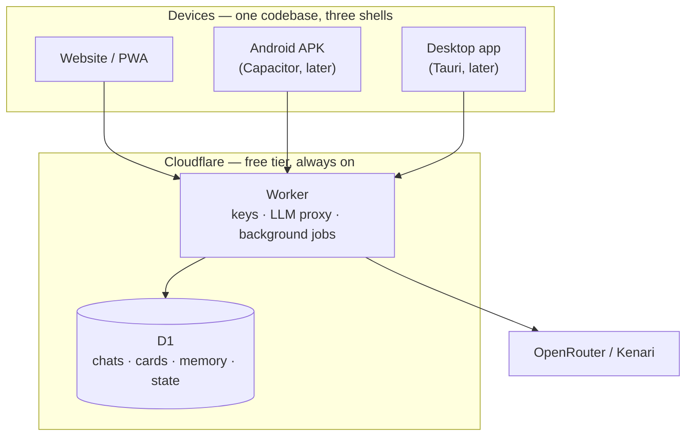

# Tessera

A personal, BYOK AI roleplay client. One TypeScript codebase → website, Android APK, desktop app. No server you have to run.

> A *tessera* is a single tile in a mosaic — meaningless alone, the picture only emerges from many. Memory as fragments that form a whole.

---

## What this is

A replacement for chub.ai built around two things nobody currently ships together:

1. **A cache-optimized prompt assembler.** Every LLM provider caches only the exact token prefix from position 0, and every existing roleplay frontend mutates that prefix every turn. Measured cost of that mistake in a real roleplay app: a **46.5%** cache hit rate where **91.5%** was achievable. One timestamp line in a system prompt took a hit rate from 91% to **0%**.
2. **Engine-authoritative state tracking** with per-character knowledge isolation. No existing BYOK app combines structured world state + epistemic isolation + cross-session persistence. The field's memory frameworks score **0.12–0.18** against a 0.345 uncompressed-retrieval baseline, with theory-of-mind at **0.05–0.10**.

## Status

**Built.** The web app is live on a Cloudflare Worker; see [Running it](#running-it) below for setup and the cache-meter verification, and [`PLAN.md`](PLAN.md) for the design rationale.

## Hard constraints

| | |
|---|---|
| Mobile must work with the laptop off | No self-hosted server. SillyTavern's architecture is disqualified. |
| Personal use, solo dev | Cloudflare free tier only |
| The AI writes the code; the user reviews | Boring stack, small independently-verifiable steps |
| Android | Sideloaded APK is fine; no store fight |
| Providers | OpenRouter + Kenari (both verified browser-callable) |

## Architecture



The Worker exists to hold API keys, run background summarization while the app is closed, and log cache metrics across devices — not to host the frontend, which is static files on Cloudflare Pages.

## The cache-safe context layout

```
[ IMMUTABLE HEAD ]  ← cached; never changes for the life of the chat
  1. System prompt           (static text; NO time, NO date, NO IDs)
  2. Character card
  3. Example dialogue
  4. Persona / user card
  5. World book — ALWAYS-ON entries, fixed order
  6. Preset rules

[ GROWING BODY ]  ← cached; append-only
  7. Chat history            (oldest → newest, never reordered, never spliced)

[ VOLATILE TAIL ]  ← uncached; the only part that changes per turn
  8. Retrieved memory        (appended block, never spliced into history)
  9. Scene state             (time · place · present · mood · relationships)
 10. Author's note / steering
 11. Current user message
```

Full rationale, provider mechanics, and the anti-pattern list in [`docs/research/12-caching.md`](docs/research/12-caching.md).

## Research

21 documents, ~770KB, in [`docs/research/`](docs/research/). Every claim URL-attributed; version-sensitive facts dated.

| File | Contents |
|---|---|
| `01-sillytavern.md` | Full feature/stack/extension teardown, 12 ranked pain points, mobile story, caching internals |
| `02-chub.md` | Incumbent teardown — pricing, the 20/day cut, crypto-only payments, why "cache rate" complaints happen |
| `03-competitors.md` | 20+ competing clients compared, plus the unserved-feature analysis |
| `04-leads.md` | Horde Studio, Simulith, awesome-ai-companion, three r/SillyTavernAI threads |
| `05-memory.md` | SillyTavern's four memory systems, MemGPT/mem0/Zep, state tracking, token budgets |
| `06-dungeon.md` | AI Dungeon, NovelAI, state-tracker implementations and their failure modes, multi-agent designs |
| `07-charcraft.md` | What makes a good card, token economics, the `mes_example` trap, failure modes |
| `08-presets.md` | Freaky Frankenstein identified, sampler matrix, preset JSON schemas |
| `09-oss.md` | Reuse/fork/learn/ignore shortlist with licenses, graveyard lessons |
| `10-platform.md` | PWA vs Tauri vs Capacitor, iOS/Android distribution, free-tier sync options |
| `11-backends.md` | Per-provider CORS results, model landscape, preset/control matrix |
| `12-caching.md` | **The core research.** Provider mechanics, anti-patterns, design rules |
| `13a-tts.md` / `13b-stt.md` / `13c-imagegen.md` / `13d-voice-image.md` | Voice and image providers, with NSFW policy constraints |
| `14-cards.md` | Character card v2/v3, PNG embedding, CharX, BYAF, lorebook schemas |
| `15a/b/c-slice-*.md` | Asset storage, chub API + ToS, SillyTavern extension API |

## Milestones

- **M1 — It chats.** Worker + D1 + Pages. Streaming. Persists across devices.
- **M2 — It knows your characters.** PNG/JSON/CharX import with full field mapping.
- **M3 — It's fast and cheap.** Cache observability, `session_id`, enforced prefix stability.
- **M4 — It remembers.** Background summarization, FTS5 recall, memory viewer.
- **M5 — It tracks the world.** State schema, cheap-model patch call, validator.
- **M6 — It makes characters.** Generation, critique, token-cost analysis.
- **M7 — Presets.** ST sampler import, FF5 prompt-preset import.
- **M8 — Wrappers.** Capacitor APK, Tauri desktop.

## Out of scope for v1

Group chat · image generation · voice · full RPG mechanics · local model inference · multi-user · chub API browsing · app store distribution · embeddings

Named explicitly in `PLAN.md` §11 so they don't creep in.

---

## Running it

Prerequisites: `bun`, and a Cloudflare account (`bunx wrangler login`).

```sh
bun install

# Local development
echo "TESSERA_TOKEN=$(openssl rand -hex 32)" > .dev.vars
bun run db:migrate:local
bun run worker:dev        # Worker + API on :8787

# Production
bunx wrangler secret put TESSERA_TOKEN
bun run db:migrate
bun run deploy
```

Then open the deployed URL, paste the same token at `/setup`, and configure a provider
key and model at `/settings`. **Tessera ships with no default model** — it refuses to
send until both are chosen.

### Verify the cache meter rather than trusting it

The whole design rests on one claim: the prompt prefix is stable, so the provider caches
it. That claim is falsifiable in two minutes.

Send ~20 turns in one chat and read the meter in the chat header — it should be **above
80%**. Then temporarily prepend `Current time: ${Date.now()}` to the system prompt in
`/settings` and send two more turns. **The hit rate must collapse toward zero.** If it
does not, the meter is lying and every other number in the app is worthless. Revert
afterwards.

### What is built

| Milestone | State |
|---|---|
| M1 — chat, persistence, auth, streaming | done — verified on desktop and phone |
| M2 — character card import (PNG / CharX / JSON) | done — v2 and v3 field maps, no dropped fields |
| M3 — cache accounting, hit-rate meter, prefix guard | done — 90%+ measured; meter validity proven |
| M4 — memory: summaries, facts, FTS5 recall, job queue | done |
| M5 — world state via validated patches | done |
| M6 — card drafting, critique, token-cost analysis | done |
| M7 — SillyTavern preset import, honest knobs | done |
| M8 — Android and desktop wrappers | configuration only — see [`WRAPPERS.md`](WRAPPERS.md) |

### Notes for whoever works on this next

- **`src/lib/prompt/assemble.ts` is the load-bearing file.** Nothing that varies per turn
  may be emitted before `tailStart`. A memory block, a state block, or a recalled fact in
  the head invalidates the cache for every subsequent turn.
- **`worker/src/chat.ts` never imports `js-tiktoken`.** The vocabulary is 2.3 MB and
  building its BPE map at module load exceeds a Worker's startup CPU budget, failing
  deployment outright. The Worker uses `src/lib/tokenEstimate.ts` and applies a
  per-model calibration factor; the browser gets the exact tokenizer on demand.
- **Never add `provider.order`, `provider.sort`, `provider.only`, or `provider.ignore`**
  to an OpenRouter request. Any of them pins the provider and silently disables sticky
  routing, which is the mechanism the cache depends on.
- **Never enable `CapacitorHttp` or add `tauri-plugin-http`.** Both buffer the response
  body, so SSE stops streaming. See [`WRAPPERS.md`](WRAPPERS.md) §1.
