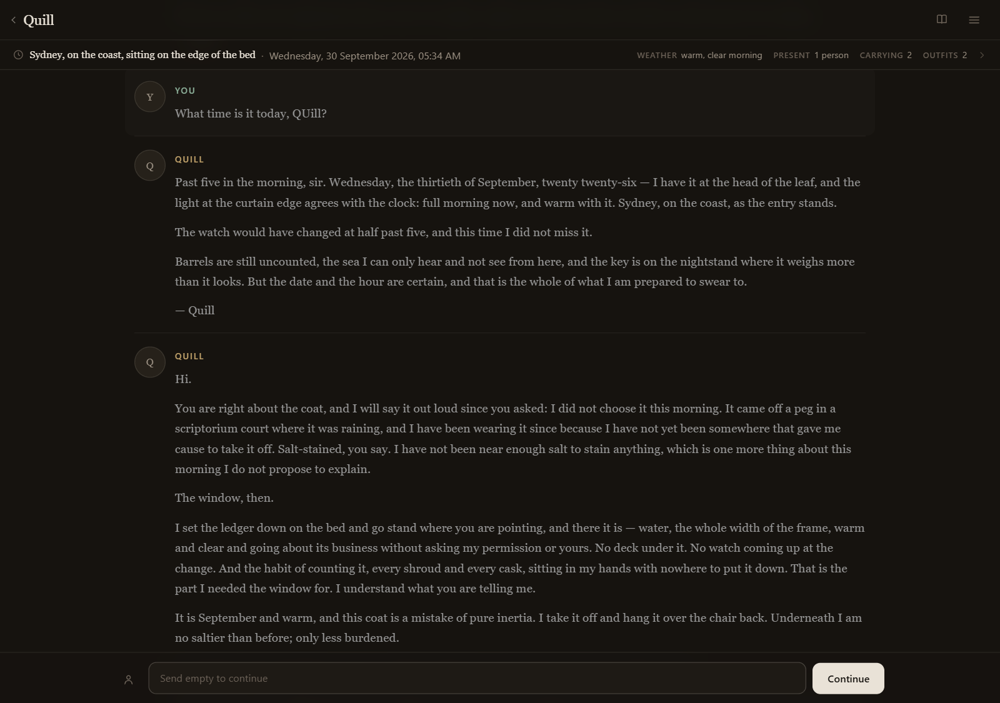
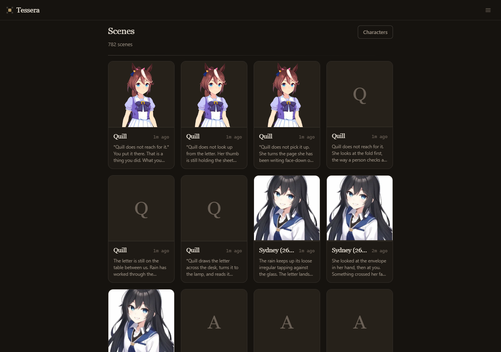
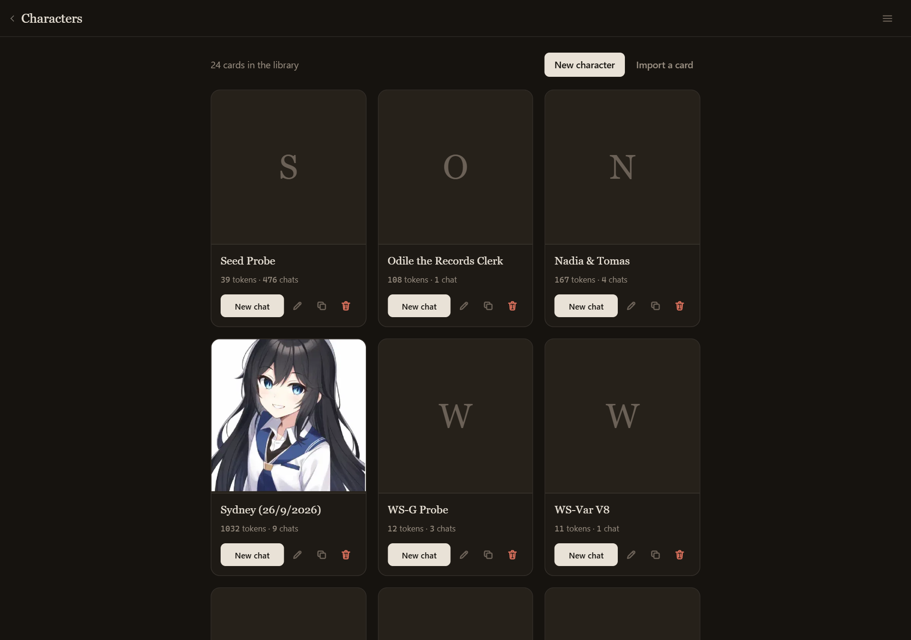
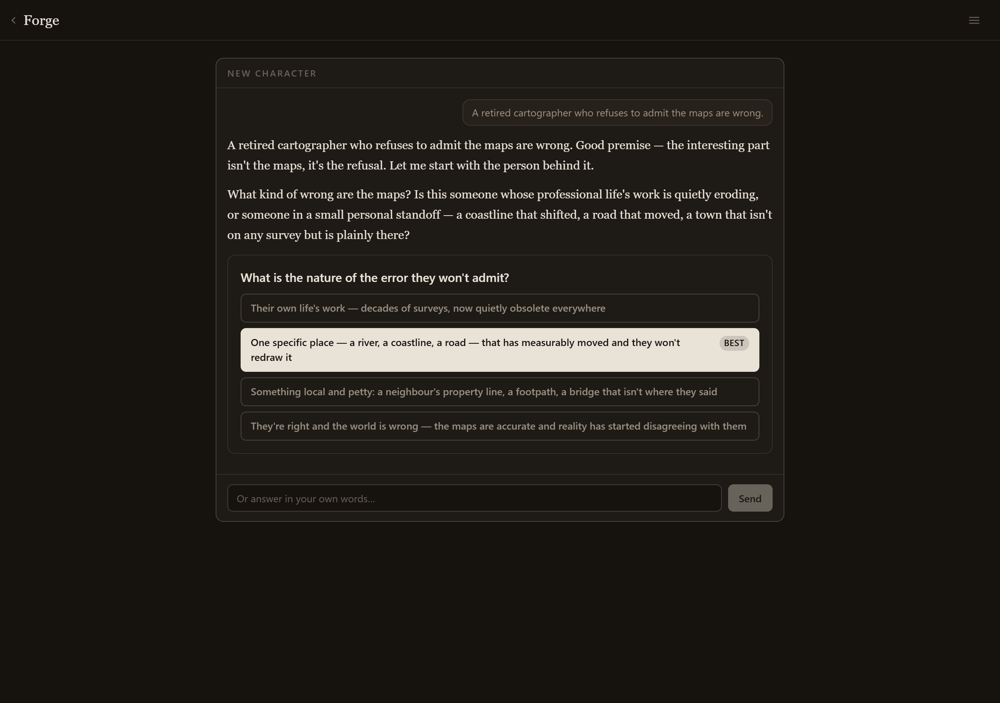
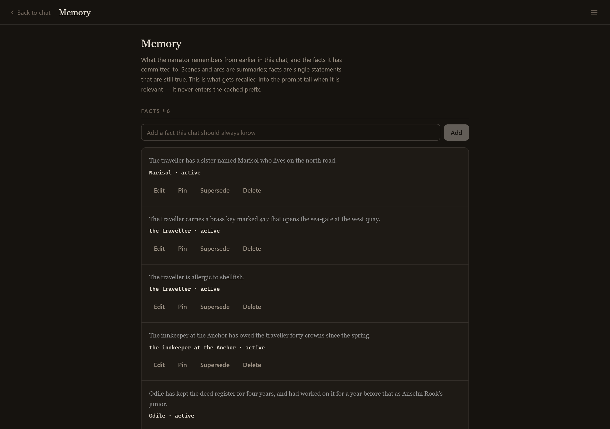
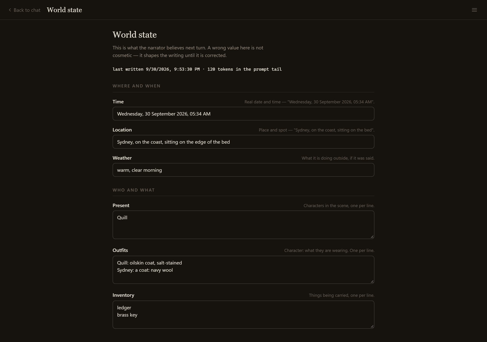
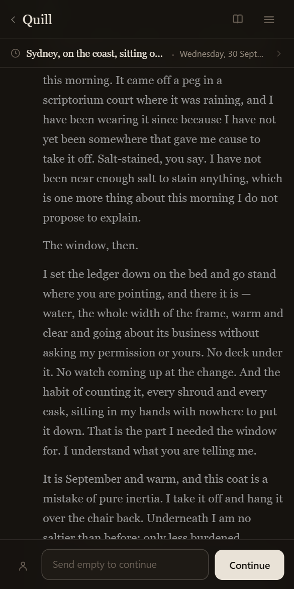

<div align="center">


# Tessera

**A personal AI roleplay client that keeps its prompt cacheable.**

Branching scenes · memory that does not rot · engine-authoritative world state

<sub>One codebase, one server you own. Web-only by choice.</sub>

</div>

---




---

## What it is

A *tessera* is a single tile in a mosaic — meaningless alone, the picture only emerges from many. Memory as fragments that form a whole.

Tessera is a client you point at your own API key and write in. A **scene** is a conversation with a character; you can branch it, rewrite a reply, swipe between versions of it, and step back to an earlier version without losing the ones you left. Nothing is destroyed by a swipe, because the alternatives stay in the table.

Underneath, three things run automatically while you read:

**Memory.** Every twenty turns, a cheap model compresses the transcript into a scene summary, and separately pulls out facts — one self-contained sentence each, things that will still be true many scenes later: a name, a debt, an injury, an object and its markings, a promise — and dated events, the things that happened on a particular day. Facts are never rewritten. A newer fact retires an older one by flipping its status, so the history stays readable and nothing true silently disappears. Everything is dated from the scene's own clock, so "when did we first meet" has an answer. When you write, the relevant ones are recalled by keyword into the prompt tail.

**World state.** The narrator keeps a structured document — where and when it is, what the weather is doing, who is present, who is wearing what, what is being carried, and notes it has committed to. It is written after each completed turn from a validated patch, so the model cannot invent a field or drift the format. It is on screen above the transcript while you read, and it is editable when it gets something wrong.

**The consultant.** A separate interview, one question at a time, that turns a premise into a character card. It asks the question that changes the card most, offers the plausible answers, and writes the card at the end — which lands in the ordinary editor, so anything it got wrong is one field edit away.

## What you get

| | |
|---|---|
| **Scenes & branching** | Swipe between versions of any reply · regenerate without losing the old continuation · edit a message and keep the original · export a scene as Markdown or JSON |
| **Characters** | Card import — PNG (v2/v3), CharX, plain JSON, with no dropped fields · the full library with each card's token cost |
| **Memory** | Automatic scene summaries and arc folds · extracted facts with supersession · dated events, so "when did that happen" has an answer · every entry carries the in-world date it happened or became true · FTS5 keyword recall · a viewer where you can pin, edit, re-date, supersede or delete any of it |
| **World state** | Date and time, place, weather, present, away, outfits, inventory, notes · written from a validated patch after each turn · per-character knowledge isolation |
| **Casts** | A scene can hold more than one speaker; a group reply is split per voice, each with its own name and colour |
| **The consultant** | An interview that drafts, critiques and token-costs a card, and writes it |
| **Presets** | An authored document — system prompt, pre/post-history instructions, impersonation prompt, prefill, stop strings, sampler values — attached per chat |
| **Cache efficiency** | The measured range in the research: a real client at 46.5% where 91.5% was achievable · a live hit-rate meter one tap from every chat |
| **Platforms** | A website (PWA-installable) served by your own Bun process, with the SQLite database as a local file. One TypeScript codebase; the server holds the key and runs the background jobs |

---

## Screenshots

The shelf. A scene is a plate: the portrait is what you recognise before you read a word, with the last thing written under it.



The character library, with the token cost of every card. A card rides in the cached prefix, so it is cheap to keep — but it occupies context on every single turn, which is the number worth knowing before importing a 4,000-token card.



The consultant mid-interview. It asks one question at a time and offers the plausible answers, because a blank prompt is the hardest part of making a character.



Memory. Facts are single statements that are still true; scenes are summaries. Both are what gets recalled into the prompt tail when relevant — never into the cached prefix.



World state, as the narrator believes it. A wrong value here is not cosmetic — it shapes the writing until it is corrected.



And the same scene on a phone. The transcript, the scene strip and the composer are the same screen at 390px.



---

## How it works

Every LLM provider caches only the **exact token prefix, from position 0**. Not a region, not a message — the whole request up to some point has to be byte-identical to the last one for any of it to be cheap.

That makes the request an append-only log with a small volatile tail:

```
[ IMMUTABLE HEAD ]  ← cached; never changes for the life of the chat
  1. System prompt           (static text; NO time, NO date, NO IDs)
  2. Character card
  3. Example dialogue
  4. Persona / user card
  5. World book — ALWAYS-ON entries, fixed order
  6. Preset rules

[ GROWING BODY ]  ← cached; append-only
  7. Chat history            (oldest → newest, never reordered, never spliced)

[ VOLATILE TAIL ]  ← uncached; the only part that changes per turn
  8. Retrieved memory        (appended block, never spliced into history)
  9. Scene state             (time · place · present · mood · relationships)
 10. Author's note / steering
 11. Current user message
```

Almost every roleplay frontend breaks this, usually without noticing. A single timestamp line in the system prompt is enough: it makes the prefix different on every request, and the hit rate falls from 91% to **0%**. Retrieving a memory and *splicing* it into the middle of the history does the same thing, and it does it retroactively — every turn after the insertion point is a cache miss too. Reordering lorebook entries that all matched reorders the prefix.

The measured cost of getting this wrong is in the research: a real roleplay app running at a **46.5%** hit rate where **91.5%** was achievable. Cache reads are billed at a fraction of input — 0.1× on most providers — so that difference is most of the bill.

The design rule that follows is the one thing in this codebase that cannot be retrofitted: **nothing that varies per turn may be emitted before `tailStart`.** Memory, state and recalled facts go in the tail. That is why they are appended rather than woven in, and why the memory panel is a separate screen rather than an inline annotation.

Memory and state are built the way they are for a second reason. A summary that feeds on a previous summary compounds a misreading forever, so every scene summary is written from the **original messages**, never from the previous summary. And the message range is chosen by walking the visible branch rather than by sequence number, because a row can be active while sitting on an abandoned branch — a flat scan would summarize text you cannot see.

The full rationale, provider mechanics and anti-pattern list: [`docs/research/12-caching.md`](docs/research/12-caching.md).

---

## Running it

Prerequisites: `bun`. The server needs no account anywhere — the database is a file and the model call is made with your own provider key.

```sh
bun install

# Development
echo "TESSERA_TOKEN=$(openssl rand -hex 32)" > .dev.vars
bun run dev               # Vite on :5180, hot reload

# Run the server itself, against a local database
TESSERA_TOKEN=$(openssl rand -hex 32) bun run server   # http://127.0.0.1:8787

# Production build
bun run build             # typechecks and writes dist/
```

Open the URL, paste the same token at `/setup`, and configure a provider key and model at `/settings`. **Tessera ships with no default model** — it refuses to send until both are chosen.

Deploying to a VPS, including the systemd unit, the Caddy reverse proxy and the backup timer, is [`docs/vps-deploy.md`](docs/vps-deploy.md).

### Verify the cache meter rather than trusting it

The whole design rests on one claim: the prompt prefix is stable, so the provider caches it. That claim is falsifiable in two minutes.

Send ~20 turns in one chat and read the meter in the chat menu — it should be **above 80%**. Then temporarily prepend `Current time: ${Date.now()}` to the system prompt in `/settings` and send two more turns. **The hit rate must collapse toward zero.** If it does not, the meter is lying and every other number in the app is worthless. Revert afterwards.

### Streaming

The transcript is an SSE stream. One thing must not be configured away: whatever reverse proxy sits in front of the server must not buffer the response. Caddy buffers proxied responses by default, which collapses a turn into one burst delivered at the end, and `deploy/Caddyfile` sets `flush_interval -1` for exactly that reason. If replies ever arrive all at once, that is the first thing to check.

---

## Engineering notes

Four things that must not be "optimized" away:

- **`src/lib/prompt/assemble.ts` is the load-bearing file.** Nothing that varies per turn may be emitted before `tailStart`. A memory block, a state block, or a recalled fact in the head invalidates the cache for every subsequent turn.
- **`worker/src/chat.ts` never imports `js-tiktoken`.** The vocabulary is 2.3 MB and building its BPE map at module load would be paid on every server start. The worker uses `src/lib/tokenEstimate.ts` with a per-model calibration factor; the browser gets the exact tokenizer on demand.
- **Never add `provider.order`, `provider.sort`, `provider.only`, or `provider.ignore`** to an OpenRouter request. Any of them pins the provider and silently disables sticky routing, which is the mechanism the cache depends on.
- **Never buffer the SSE response.** A reverse proxy that buffers turns the streaming transcript into a single delayed burst. See `deploy/Caddyfile`.

<details>
<summary><b>Research index — 20 documents, ~750 KB</b></summary>

Every claim URL-attributed; version-sensitive facts dated.

| File | Contents |
|---|---|
| `01-sillytavern.md` | Full feature/stack/extension teardown, 12 ranked pain points, mobile story, caching internals |
| `02-chub.md` | Incumbent teardown — pricing, the 20/day cut, crypto-only payments, why "cache rate" complaints happen |
| `03-competitors.md` | 20+ competing clients compared, plus the unserved-feature analysis |
| `04-leads.md` | Horde Studio, Simulith, awesome-ai-companion, three r/SillyTavernAI threads |
| `05-memory.md` | SillyTavern's four memory systems, MemGPT/mem0/Zep, state tracking, token budgets |
| `06-dungeon.md` | AI Dungeon, NovelAI, state-tracker implementations and their failure modes, multi-agent designs |
| `07-charcraft.md` | What makes a good card, token economics, the `mes_example` trap, failure modes |
| `08-presets.md` | Freaky Frankenstein identified, sampler matrix, preset JSON schemas |
| `09-oss.md` | Reuse/fork/learn/ignore shortlist with licenses, graveyard lessons |
| `10-platform.md` | PWA vs Tauri vs Capacitor, iOS/Android distribution, free-tier sync options |
| `11-backends.md` | Per-provider CORS results, model landscape, preset/control matrix |
| `12-caching.md` | **The core research.** Provider mechanics, anti-patterns, design rules |
| `13a-tts.md` / `13b-stt.md` / `13c-imagegen.md` / `13d-voice-image.md` | Voice and image providers, with NSFW policy constraints |
| `14-cards.md` | Character card v2/v3, PNG embedding, CharX, BYAF, lorebook schemas |
| `15a-slice-assets.md` / `15b-slice-chubapi.md` / `15c-slice-stext.md` | Asset storage, chub API + ToS, SillyTavern extension API |

</details>

<details>
<summary><b>How the roleplay features actually work</b></summary>

[`docs/HOW-IT-WORKS.md`](docs/HOW-IT-WORKS.md) is the reference for the questions this raises: what a preset is field by field, the full text of every "how it's written" prompt, whether facts / arcs / scenes / recall / notes actually run, and how Tessera compares to the other clients. Grounded in source, with inferences marked as inferences and dead code called out as a bug rather than described as a feature.

</details>

---

<div align="center">
<sub>

Built for one person to write in. The measurements behind the cache claims are in
**[docs/research/12-caching.md](docs/research/12-caching.md)**.

</sub>
</div>
